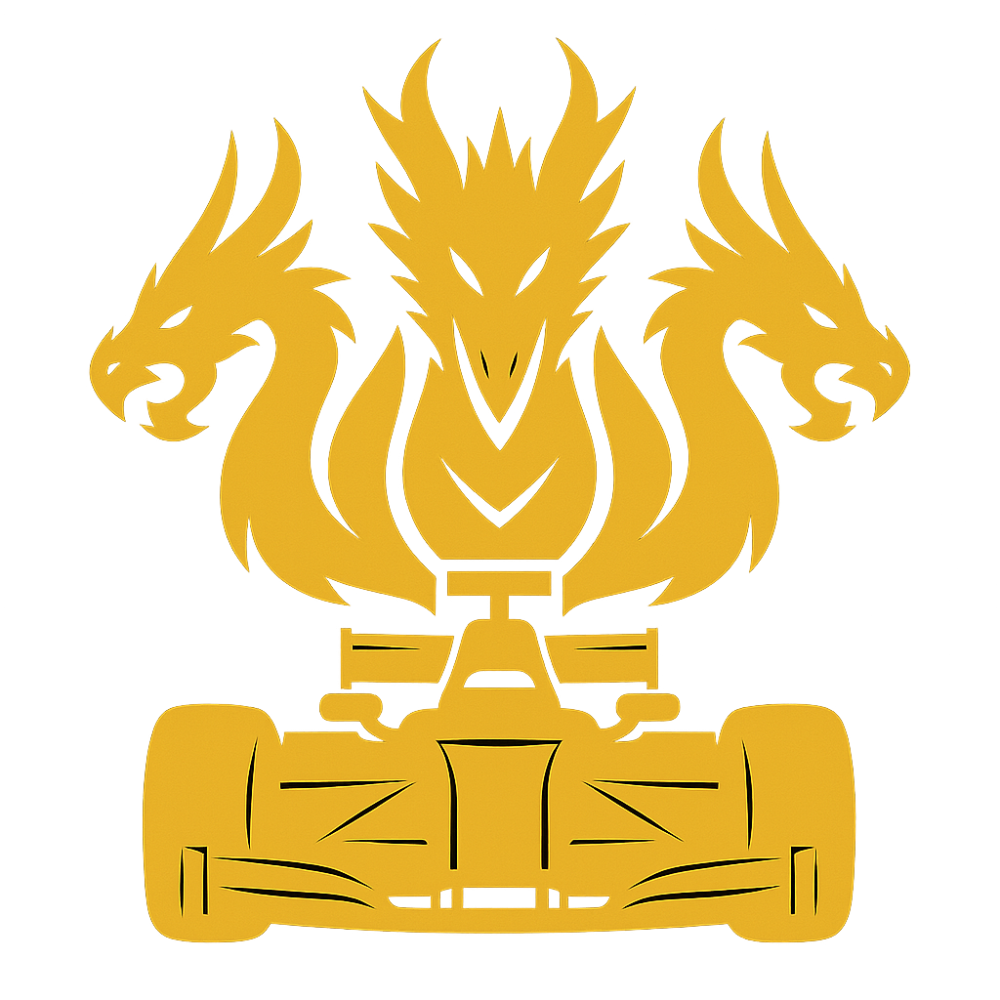

<div style="display: flex; align-items: center;">
  
</div>

# Hydrakon | HWUD
**Hydrakon** is the central codebase for our participation in Formula Student UK 2025. It houses all the software systems used to control and operate the ADS-DV (Autonomous Driving System – Development Vehicle).
- Nvidia Jetson AGX Orin (64 GB)
- ZED2i Stereo Camera
- Robosense Helios 16
- CHCNAV CGI-410 (INS)
- TP-Link AX1500 Wi-Fi 6

## Network Settings
- **Ethernet Connections**
  - **Jetson AGX Orin** ➔ 192.168.1.100 (LAN1)
  - **Robosense Helios 16** ➔ 192.168.1.200 (LAN2)
  - **CHCNAV CGI-410 INS** ➔ 192.168.1.201 (LAN3)

- **LiDAR configuration**
  - **Device IP Address** ➔ 192.168.1.200
  - **Device IP Mask** ➔ 255.255.255.0
  - **Device IP Gateway** ➔ 192.168.1.1
  - **Destination IP Address** ➔ 192.168.1.100 **(Jetson)**
  - **MSOP Port** ➔ 6699
  - **DIFOP Port** ➔ 7788
  - **Return Mode** ➔ Strongest
  - **Rotation Speed** ➔ Set it to 600/1200 as needed
  - **Operation Mode** ➔ High Performance

## Configuring the Router
- Connect the router to your Dev System using an Ethernet cable, and then navigate to [192.168.0.1](http://192.168.0.1) or [192.168.1.1](http://192.168.1.1) depending on your router
- Set the admin password and Wi-Fi password
- Go to Advanced ➔ Backup and Restore
- Then download the configuration file from [here](/TPLinkConfig.bin) and load it in
- You should now have your router configured **:P**

## Getting Started
1. Make sure you have ROS2 Installed, if not follow instructions [here](https://docs.ros.org/en/humble/Installation/Ubuntu-Install-Debs.html)
2. Get the RSLidar SDK package from [here](https://github.com/RoboSense-LiDAR/rslidar_sdk)
3. Get the RSLidar MSG package from [here](https://github.com/RoboSense-LiDAR/rslidar_msg)
4. Clone this repository using `git clone https://github.com/FS-AI-HWUD/Hydrakon.git`
5. Add the `rslidar_sdk` and  `rslidar_msg` into the repository
6. Source ROS2 using `source /opt/ros/<version>/setup.bash` **(replace version with your version of ROS2)**
7. Run the following commands one after the other
    ```shell
    colcon build --symlink-install
    source install/setup.bash
    ros2 launch fs_launch hydrakon_launch.py
    ```
8. **YIPPEE** you now have everything working **(I hope) :P**, move on to [visualizing data](#to-visualize-data)

## To Visualize Data
- Ensure you have Foxglove Studio Installed, else download it from [here](https://foxglove.dev/download)
- Ensure you have [configured your router](#configuring-the-router) using the [.bin](/TPLinkConfig.bin) file
- Connect to the Hotspot from the router
- Open Foxglove ➔ Open connection ➔ Foxglove websocket
- Then connect to `ws://192.168.1.100:8765`
- You have now connected to the Jetson, feel free to add in any topics as you like


## Our recommended system configuration
- **Dev Systems**
  - **CPU**: Intel i7-12th Gen and above, Ryzen 7-11 and above
  - **GPU**: RTX 3060 and above
  - **RAM**: Min 16 GB RAM
  - **Storage**: Min 10 GB
  - **OS**: Ubuntu 22.04 LTS
  - **ROS2 Version**: ROS2 Humble

## Common Issues

**LiDAR not detected:**
- Check physical connections (LAN2 port)
- Verify LiDAR IP: `ping 192.168.1.200`

**Cannot SSH to Jetson:**
- Use Ethernet IP: `ssh username@192.168.1.100`

**Foxglove can't connect:**
- Ensure connected to router WiFi
- Check Jetson IP: `ws://192.168.1.100:8765`

**If any other issues arise, feel free to contact our team at [Hydrakon](https://www.instagram.com/atlasracingfs/). Don't worry, Hydrakon, and Atlas Racing come under HWURacing**